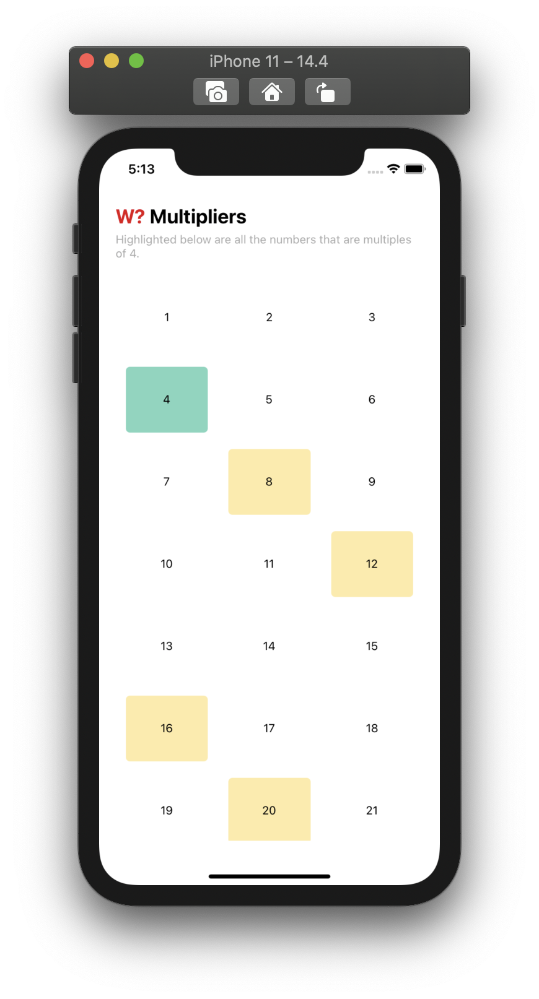

# Which? Mobile QA Exercise

---

## Getting Started

Install all dependencies with `yarn` which will also run `pod install` on post install. You should be able to run both `yarn ios` and `yarn android` to run respective iOS and Android simulations of the application.

The application highlights multiples of a selected number in a 1-144 grid &mdash; for instance the multiples of **38** are **76** and **114**. Numbers highlighted in yellow are the multiples, and in green is the currently selected number we're displaying the multiples for.

## Exercise

Whilst the application functions correctly, and the developer has put together a handful of unit tests; the application doesn't _yet_ have **any** integration tests. Please put together an integration test suite for the application, to ensure the app is stable and that it behaves correctly on interactions for the **debug** build.

It doesn't matter which library you choose to write the integration tests, but popular ones include [Detox](https://github.com/wix/Detox) and [Appium](https://github.com/appium/appium).

Once you've created the integration tests, please allow them to be run using the `yarn integration` command.
